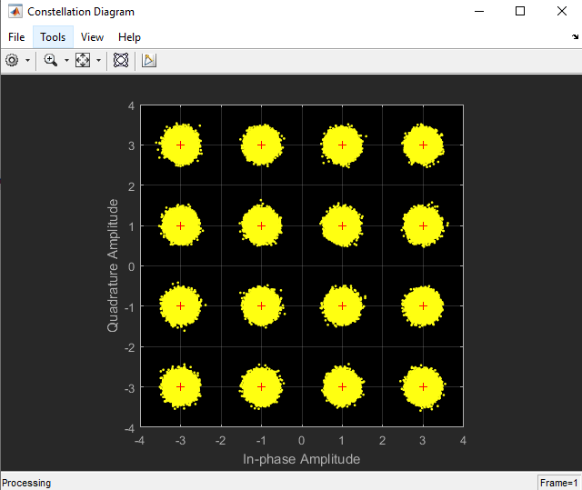

# Digital-Information-Modulation-Schemes
Performance of Different Modulation types (ASK – FSK – PSK).

  ASK has many cases, but the case we are interested in here is the special case which is called
OOK.
  PSK has many cases, but the case we are interested in here is the special case which is called
PRK.
  FSK has many cases, but the case we are interested in here is the special case which is called
orthogonal-FSK, in which the 2 transmitted bits are sent on 2 orthogonal carriers.

 
 the following is the comparison plot between the performance of the previous digital modulation schemes  

 
 the constellation diagram of the 16QAM

